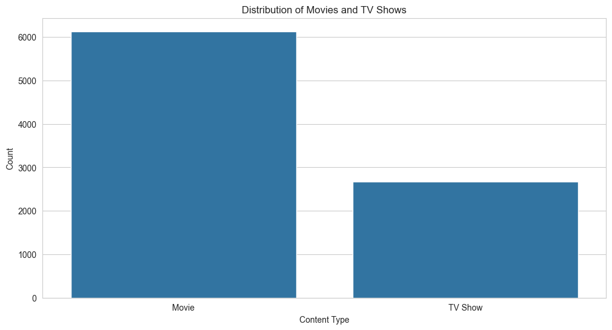
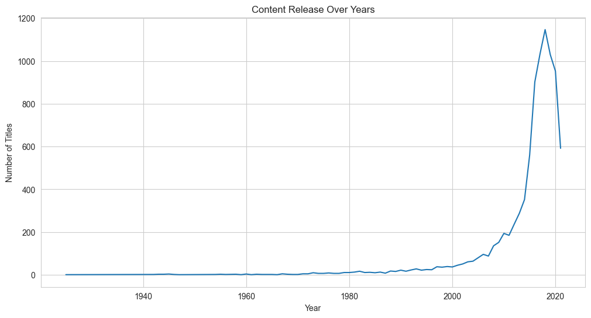
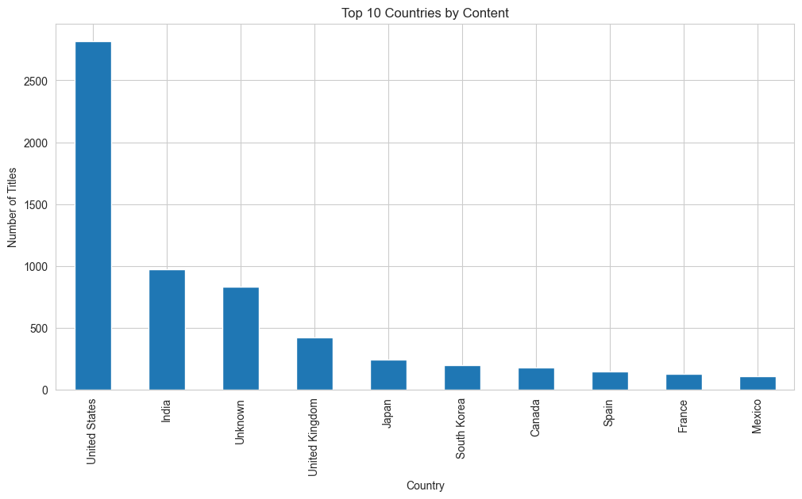
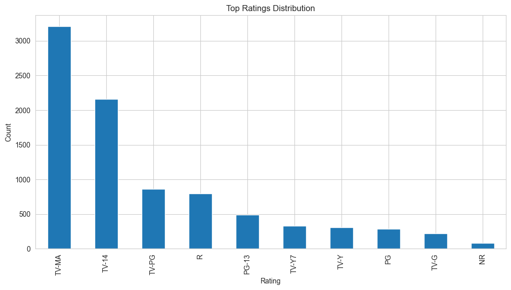
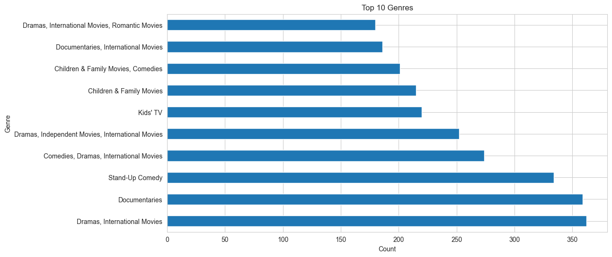

# Netflix Data Analysis

Exploratory Data Analysis (EDA) project using Python and Netflix dataset from Kaggle.

## Objective

Analyze Netflix catalog data to identify trends, patterns, and business insights.

## Technologies

- Python
- Pandas
- Matplotlib
- Seaborn
- Jupyter Notebook

## Dataset

Netflix Movies and TV Shows dataset from Kaggle.

## Main Analyses

- Movies vs TV Shows
- Content growth over time
- Top producing countries
- Most common genres
- Ratings distribution

## Main Insights

- Movies dominate the Netflix catalog
- Significant platform growth after 2015
- Strong concentration of US productions

## How to Run
## How to Run

```bash
    pip install -r requirements.txt
    jupyter notebook

```
## Visualizations

### Movies vs TV Shows



---

### Content Release Over Years



---

### Top Countries by Content



---

### Ratings Distribution



---

### Top Genres




## Author

Rodrigo Garcia

- GitHub: https://github.com/rodrigo77garcia
- LinkedIn: https://www.linkedin.com/in/rodrigo-garcia-a5ba501a1